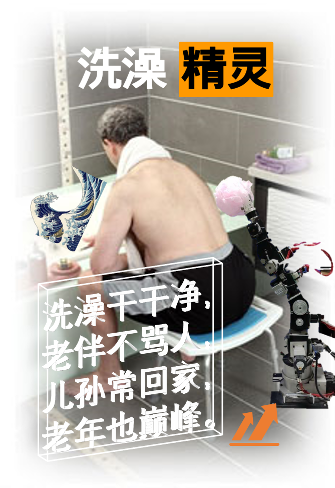

这是 UESTC S0427020.01 实验课的代码。

课程一共为期两周，学生从现有平台上，从头脑风暴中自主命题，自主设计指标，最后学生自主投票与得分挂钩。

本组的设计为帮助老人洗澡的机器。基于一个6自由度机械手平台，这个平台稍显老旧，实际使用了4个轴，都是步进电机轴，上电还得校准一下。

两周时间还要包含前面三天讨论题目的时间和熟悉平台的时间，所以...完成度你懂的，完全是展示oriented programming。所以估计也没啥人真的对这短时间糊出来的代码感兴趣。既然现在学校教改这么喜欢要求课程必须要展示，那就当存个档了。

openpose部分基于 [openpose.py](https://github.com/opencv/opencv/blob/master/samples/dnn/openpose.py) 几乎没有改动。你可以使用 `opencv/downloadmodels.sh` 一键下载模型，用在其他需要糊的实验课中。

贴个最后的海报作业。

